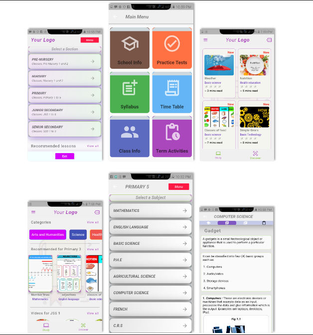

# Notes_frame_07_-MIP-

> MIP (Minimum Illustratable Product) *think wireframing, but with code*  

An intuitive approach in attempting to solve some problems the author of this project observed while serving as a teacher in the Elementary School System... Details are provide in [Notebook's Mission](Revised_Mobile_app_Development_Proposal.pdf)  

## Preview



## ALERT
**This is a simple illustration... The author of this project does not recommend copying this code as there are MANY bad practice methods which never got to be refactored. But it works!!!**

## Features
- Lessons Section of the app where pupils, parents and teachers gain access to pupils subjects topics | requirements | and explanations, ranked by grade...

- Explore Section of the app that grants pupils access to a plethora of educational discovery and amusement, in line with their grade...


## Content Copyright claims
Media contents used in this project belong to their respective creators/ authors from their respective platforms. No claim has and shall be made by the author of this project and the users of this project...


## Tech Stats
**Client**: Flutter


## Getting started

#### 1. [Setup Flutter](https://flutter.io/setup/)

#### 2. Clone the repo

```sh
$ git clone https://github.com/x9x96/Notes_frame_07_-MIP-
$ cd Notes_frame_07_-MIP-/
```


## How to Contribute
1. Fork the the project
2. Create your feature branch (git checkout -b my-new-feature)
3. Make required changes and commit (git commit -am 'Add some feature')
4. Push to the branch (git push origin my-new-feature)
5. Create new Pull Request
